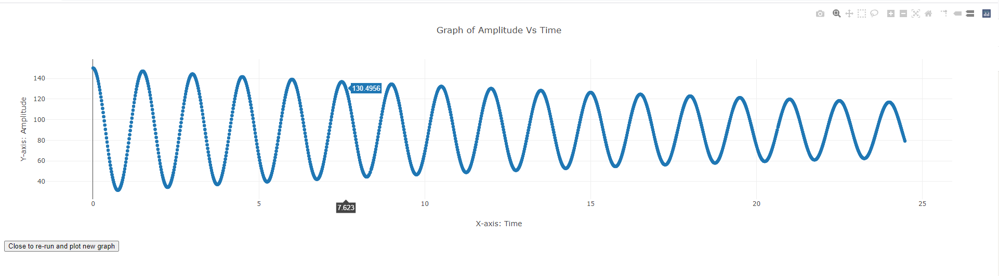

# Simple Pendulum Simulation for Virtual Labs (Solve)
This repo is a demostration for the kind of work that I did while at [CSD NIT-K](https://csd.nitk.ac.in/) for [V-Labs](www.vlab.co.in/). This repository is focused on simulating a simple pendulum with damping for students to take reading and perform their lab experiment without needing to be in a physical lab with the required apparatus to perform this experiment

## Screenshots

## How to access 

This virtual lab can be accessed by clicking on the following [link](https://manand881.github.io/Simple_Pendulum/). 

## How to use

* Set the parameters on the right hand side. make note that not all parameters are accessable since some parameters are co-dependent.
* Press play and take the reading as instructed.
* press the graph icon to view the real time graph.
* pressing the stop button will reset the experiment and the graph.
